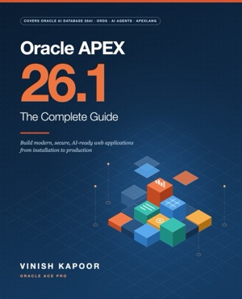
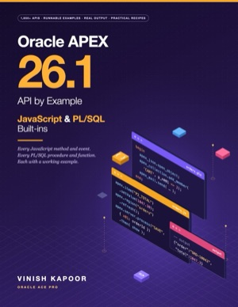
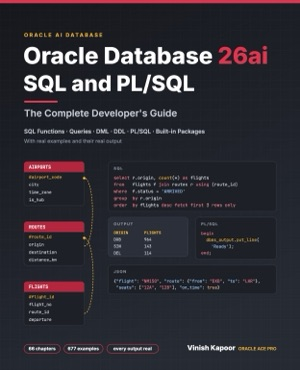
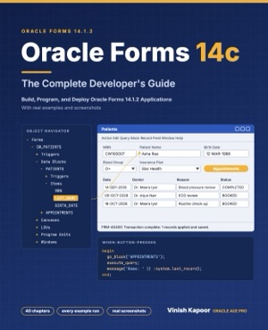
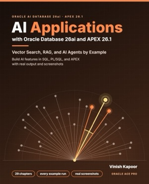

# Hi, I'm Vinish Kapoor 👋

**Oracle ACE Pro · Author · Oracle APEX, SQL and PL/SQL developer · Founder of [vinish.dev](https://vinish.dev)**

I'm an Oracle developer and architect from India, and a member of the Oracle ACE Program at the **Oracle ACE Pro** level, recognized every year since 2020. I've built database applications for more than two decades: first with Oracle Forms and Reports, and today with **Oracle APEX**, **SQL and PL/SQL**, and **Oracle AI Database 26ai**.

I write practical, example-first tutorials on [vinish.dev](https://vinish.dev) (formerly foxinfotech), read by Oracle developers around the world. I'm also the author of five books on Oracle. Their example code is on this GitHub account, free to download.

## 📚 My Books

<table>
<tr>
<td align="center" width="33%" valign="top">
 
<b>Oracle APEX 26.1: The Complete Guide</b> 
828 pages · 48 chapters 
<a href="https://www.amazon.com/dp/B0HKWGLMXD">Paperback</a> · <a href="https://www.amazon.com/dp/B0HKW571TW">Kindle</a> 
<a href="https://github.com/devvinish/apex-book-code-examples">Code</a> · <a href="https://vinish.dev/oracle-apex-26-1-book-the-complete-guide">Book page</a>
</td>
<td align="center" width="33%" valign="top">
 
<b>Oracle APEX 26.1 API by Example</b> 
528 pages · PL/SQL and JavaScript APIs 
<a href="https://www.amazon.com/dp/B0HL1R8HLP">Paperback</a> · <a href="https://www.amazon.com/dp/B0HKZXR17R">Kindle</a> 
<a href="https://github.com/devvinish/apex-book-code-examples/tree/main/api-book">Code</a> · <a href="https://vinish.dev/oracle-apex-26-api-by-example-book">Book page</a>
</td>
<td align="center" width="33%" valign="top">
 
<b>Oracle Database 26ai SQL and PL/SQL</b> 
677 examples with real output 
<a href="https://www.amazon.com/dp/B0HL5Z7LSK">Paperback</a> · <a href="https://www.amazon.com/dp/B0HL5ZNRFT">Kindle</a> 
<a href="https://github.com/devvinish/oracle-database-26ai-book-code">Code</a> · <a href="https://vinish.dev/oracle-database-26ai-sql-plsql-book">Book page</a>
</td>
</tr>
<tr>
<td align="center" width="33%" valign="top">
 
<b>Oracle Forms 14c: The Complete Developer's Guide</b> 
484 pages · 64 forms 
<a href="https://www.amazon.com/dp/B0HLDRSDGR">Paperback</a> · <a href="https://www.amazon.com/dp/B0HL9N1BKV">Kindle</a> 
<a href="https://github.com/devvinish/oracle-forms-book-code">Code</a> · <a href="https://vinish.dev/oracle-forms-14c-book">Book page</a>
</td>
<td align="center" width="33%" valign="top">
 
<b>AI Applications with Oracle Database 26ai and APEX 26.1</b> 
409 pages · vector search, RAG and AI agents 
<a href="https://www.amazon.com/dp/B0HLXFCF1G">Paperback</a> · <a href="https://www.amazon.com/dp/B0HLXN2BD4">Kindle</a> · <a href="https://books.apple.com/us/book/ai-applications-with-oracle-database-26ai-and-apex-26-1/id6819165636">Apple Books</a> 
<a href="https://github.com/devvinish/oracle-ai-book-code">Code</a> · <a href="https://vinish.dev/oracle-ai-applications-book">Book page</a>
</td>
</tr>
</table>

All my books are on my **[Amazon author page](https://www.amazon.com/author/vinish-kapoor)**. Every example in them was run against a real database, and the output printed is the output it returned.

## 🛠️ Open Source

- **[VinAura PDF](https://github.com/devvinish/pdfgen-apex)**: a visual PDF report designer for Oracle APEX. Design invoices, statements and labels on a canvas, and generate them with one PL/SQL call. ([Learn more](https://vinish.dev/vinaura-pdf-report-designer-oracle-apex))
- **[Oracle APEX book code](https://github.com/devvinish/apex-book-code-examples)**: the Orbit Sales app, sample schema and chapter examples for my APEX books.
- **[Oracle Database 26ai book code](https://github.com/devvinish/oracle-database-26ai-book-code)**: 677 SQL and PL/SQL examples and the Nimbus Air sample schema.
- **[Oracle Forms 14c book code](https://github.com/devvinish/oracle-forms-book-code)**: 64 Oracle Forms 14.1.2 forms and the CareWell Clinic sample schema.
- **[Oracle AI book code](https://github.com/devvinish/oracle-ai-book-code)**: AI Vector Search, RAG and APEX AI examples, and the Atlas Support sample app.

## 💡 What I Work With

**Oracle APEX** · **SQL** · **PL/SQL** · **Oracle AI Database 26ai** · **AI Vector Search** · **RAG and AI agents** · **Oracle Forms and Reports** · **JavaScript** · **ORDS and REST APIs**

## 🌐 Find Me

- 📝 Blog: [vinish.dev](https://vinish.dev), Oracle SQL, PL/SQL and APEX tutorials ([about me](https://vinish.dev/about-vinish-kapoor))
- 📚 Books: [amazon.com/author/vinish-kapoor](https://www.amazon.com/author/vinish-kapoor)
- 💼 LinkedIn: [linkedin.com/in/vinish-kapoor](https://www.linkedin.com/in/vinish-kapoor/)
- 𝕏 X: [@vinish_kapoor](https://x.com/vinish_kapoor)
- 👍 Facebook: [vinishkapoor.dev](https://www.facebook.com/vinishkapoor.dev)
- 💬 Reddit: [u/vinishkapoor](https://www.reddit.com/user/vinishkapoor/)
